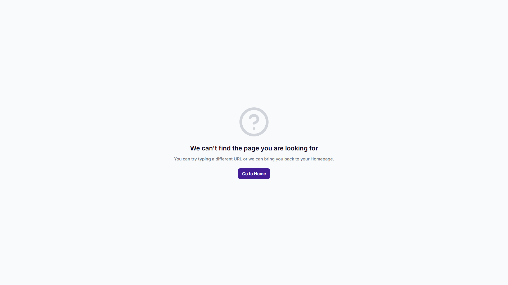
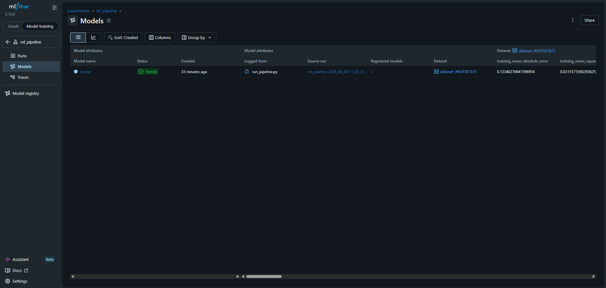
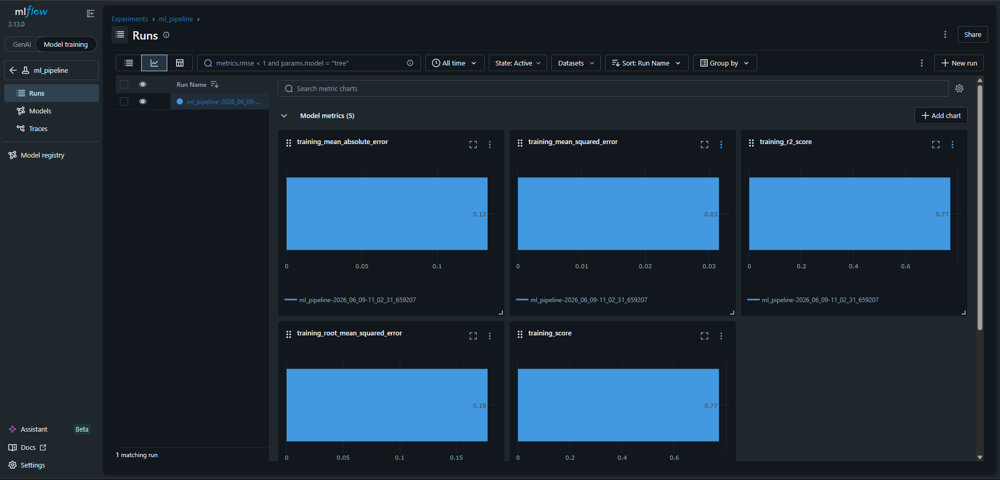

# House Price Predictor - End-to-End MLOps System

[](https://python.org)
[](https://zenml.io)
[](https://mlflow.org)
[](LICENSE)

An end-to-end, production-grade Machine Learning pipeline for predicting house prices. This project utilizes modern MLOps tools to create a robust, reproducible, and trackable machine learning workflow.

## Table of Contents
- [Overview](#overview)
- [Architecture & Dashboards](#architecture--dashboards)
- [Pipeline Steps](#pipeline-steps)
- [Installation](#installation)
- [Usage](#usage)

## Overview
This repository contains a full ML pipeline designed to ingest raw housing data, clean it, train a linear regression model, and evaluate its performance. Instead of standalone Jupyter notebooks, this project uses **ZenML** for orchestration and **MLflow** for experiment tracking to ensure every step is modular, cached, and production-ready.

## Dataset & Performance Metrics
- **Dataset**: Ames Housing Dataset (2,930 entries, 82 features)
- **Key Metrics Achieved**:
  - **R-Squared (R²)**: 0.582
  - **Root Mean Squared Error (RMSE)**: 0.259
  - **Mean Absolute Error (MAE)**: 0.187
  - **Mean Squared Error (MSE)**: 0.067
  - **Training Score**: 0.582

## Architecture & Dashboards

### ZenML Pipeline DAG
ZenML orchestrates the workflow. Below is the directed acyclic graph (DAG) of the ML pipeline:



### MLflow Experiment Tracking
MLflow automatically logs all models, metrics (MSE, RMSE, MAE, R-Squared), and schema artifacts. You can track your experiments and view registered models:

**Experiments View:**


**Model Registry:**


### MLflow Metric Charts
You can also visualize the logged metrics as charts over multiple runs to compare model performance:



## Pipeline Steps

The pipeline (`training_pipeline.py`) is structured into several modular steps:
1. **Data Ingestion** (`data_ingestion_step`): Loads raw data from a zip archive.
2. **Handle Missing Values** (`handle_missing_values_step`): Imputes missing data using statistical methods (e.g., mean imputation).
3. **Feature Engineering** (`feature_engineering_step`): Applies log transformations to skewed features.
4. **Outlier Detection** (`outlier_detection_step`): Removes anomalies using Z-score methods.
5. **Data Splitting** (`data_splitter_step`): Splits the dataset into training and testing sets.
6. **Model Building** (`model_building_step`): Trains a Linear Regression model.
7. **Model Evaluation** (`model_evaluator_step`): Computes MSE, RMSE, MAE, and R-Squared metrics on the test set.

## Installation

1. Clone the repository:
```bash
git clone https://github.com/Aamod007/Price-Prediction-Pipeline.git
cd Price-Prediction-Pipeline
```

2. Create and activate a virtual environment:
```bash
python -m venv venv
source venv/bin/activate  # On Windows use: .\venv\Scripts\activate
```

3. Install the required dependencies:
```bash
pip install -r requirements.txt
zenml integration install mlflow -y
```

## Usage

### 1. Initialize ZenML and MLflow Stack
Set up the tracking tools locally:
```bash
zenml experiment-tracker register mlflow_tracker --flavor=mlflow
zenml stack register mlflow_stack -a default -o default -e mlflow_tracker
zenml stack set mlflow_stack
```

### 2. Run the Pipeline
Execute the full end-to-end pipeline:
```bash
python run_pipeline.py
```

### 3. View the Dashboards
To view your pipeline execution graph in ZenML:
```bash
zenml login --local --blocking
# Open http://127.0.0.1:8237 in your browser
```

To view your tracked experiments and metrics in MLflow:
```bash
# Windows:
$env:MLFLOW_ALLOW_FILE_STORE="true"
mlflow ui --backend-store-uri 'file:C:\Users\aamod\AppData\Roaming\zenml\local_stores\977ca20e-a3b1-4595-945a-8040cf0f02f2\mlruns'

# Linux/Mac:
export MLFLOW_ALLOW_FILE_STORE=true
mlflow ui --backend-store-uri 'file:~/.config/zenml/local_stores/...' 
```

---
*Built by Aamod Kumar with ZenML & MLflow.*
